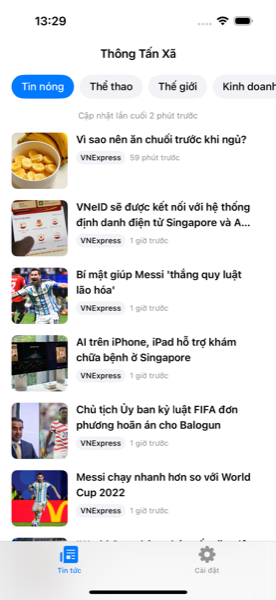
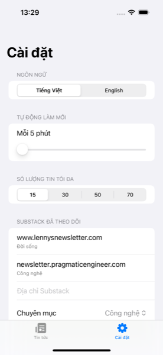

# VietNews (Thông Tấn Xã)


A centralized iOS news reader that pulls from multiple sources into one feed: NYT, Reddit, Reuters, VNExpress, Eurogamer, Substack, and generic RSS/Atom. Built with SwiftUI, supports Vietnamese and English, and runs entirely on-device with no backend of its own.

## Screenshots

| Feed | Settings |
|---|---|
|  |  |

## Features

- Aggregates NYT, Reddit, Reuters, VNExpress, Eurogamer, Substack, and any generic RSS/Atom feed into one timeline
- Category tabs (Hot News, Sport, World, Finance, and more), with some categories only shown in the language they make sense for
- Vietnamese and English localization, switchable at runtime from Settings
- Configurable auto-refresh interval and max articles per category
- Add your own Substack subscriptions by URL, no code changes needed
- Disk cache with a TTL, so the feed still shows something useful when offline
- Custom relative timestamps (minutes, hours, then a calendar date after 7 days)

## Tech stack

| Layer | Choice |
|---|---|
| Language | Swift 5.9 |
| UI | SwiftUI views hosted in a UIKit `SceneDelegate` |
| Minimum target | iOS 16.0 |
| Package manager | Swift Package Manager, wired through [XcodeGen](https://github.com/yonaskolb/XcodeGen) |
| RSS/Atom parsing | [FeedKit](https://github.com/nmdias/FeedKit) |
| Dependency injection | [Factory](https://github.com/hmlongco/Factory) |
| Project generation | `project.yml` (the `.xcodeproj` itself is gitignored) |

## Architecture

Clean-ish layering under `VietNews/`, with dependencies flowing inward:

```
Presentation --> Domain <-- Data
                   ^
                   |
             Infrastructure
```

| Layer | Contents |
|---|---|
| `App/` | `AppDelegate`, `SceneDelegate`, `RootView`, UI test support hooks |
| `Domain/` | Pure models (`Article`, `NewsSource`, `NewsCategory`, `Language`, `NewsError`), repository protocols, use cases (`FetchNewsUseCase`, `RefreshNewsUseCase`). No Foundation networking, UIKit, or SwiftUI imports allowed here. |
| `Data/` | `DTOs/` (per-provider decode types), `Network/` (`NetworkService`, `RSSParser`, HTML helpers), `Sources/` (per-provider adapters), `Repositories/` (`RemoteArticleRepository`, `DiskCacheRepository`) |
| `Infrastructure/` | `DI/Container+Registrations.swift` (Factory), `Storage/` (`UserPreferences`, `NetworkMonitor`), `Timer/AutoRefreshScheduler` |
| `Presentation/` | `NewsFeed/` and `Settings/` SwiftUI views and view models, shared `Components/` |

Adding a new source means: create `Data/Sources/<Name>Source.swift` conforming to `NewsSourceAdapter`, add a DTO under `Data/DTOs/` if the response needs custom decoding, register it in `Container+Registrations.swift`, and extend `NewsSource` in `Domain/Models/`.

## Getting started

You need Xcode 15+, [XcodeGen](https://github.com/yonaskolb/XcodeGen), and a free NYT API key.

```bash
# Install XcodeGen if you don't have it
brew install xcodegen

# Clone and set up secrets
git clone git@github.com:nphkhiem/vietnews.git
cd vietnews
cp Secrets.xcconfig.example Secrets.xcconfig

# Generate and open the Xcode project
xcodegen generate
open VietNews.xcodeproj
```

### Code highlight: bring your own API key

The only credential the app needs is an NYT API key, and it's never committed to git. `Secrets.xcconfig` is gitignored, and `project.yml` injects it into `Info.plist` at generate time:

```yaml
# project.yml
info:
  properties:
    NYT_API_KEY: "$(NYT_API_KEY)"
```

Your own key goes in `Secrets.xcconfig` (copied from the tracked `Secrets.xcconfig.example`, never quoted):

```
NYT_API_KEY = your_real_key_here
```

At runtime, the DI container reads it straight out of the app bundle, no config parsing, no third-party secrets manager:

```swift
// Infrastructure/DI/Container+Registrations.swift
var nytSource: Factory<NewsSourceAdapter> {
    self {
        let apiKey = Bundle.main.object(forInfoDictionaryKey: "NYT_API_KEY") as? String ?? ""
        return NYTSource(network: self.networkService(), apiKey: apiKey)
    }
}
```

Get a free key at [developer.nytimes.com](https://developer.nytimes.com), enable the Top Stories API, and you're good to go. Every other source (Reddit, Reuters, VNExpress, Eurogamer, Substack, generic RSS) needs no key at all.

## Build and test

```bash
# Build
xcodebuild -project VietNews.xcodeproj -scheme VietNews \
  -destination 'platform=iOS Simulator,name=iPhone 15' build

# Unit + UI tests
xcodebuild -project VietNews.xcodeproj -scheme VietNews \
  -destination 'platform=iOS Simulator,name=iPhone 15' test
```

`VietNewsTests/` mirrors the production layering (`Domain`, `Data`, `Infrastructure`, `Presentation`, `Integration`), plus `Fixtures/` and `Helpers/`. `VietNewsUITests/` covers smoke and feed flows.

## Contributing

1. Fork the repo and create a branch off `main`
2. Make your change, following the existing layering and naming conventions
3. Run the build and test commands above, both should be green with no new warnings
4. Open a pull request describing what changed and why

Bug reports and feature ideas are welcome as GitHub issues.
