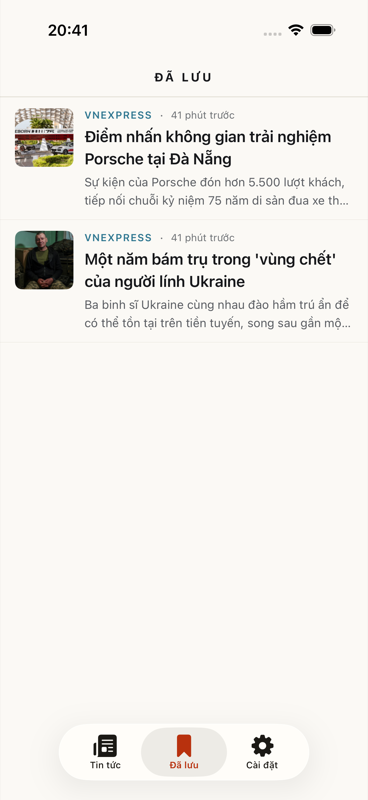
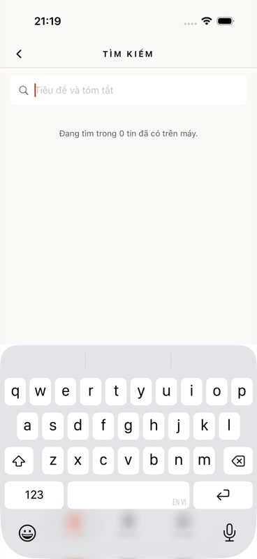
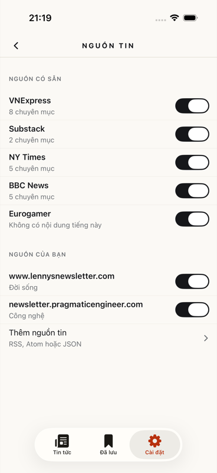
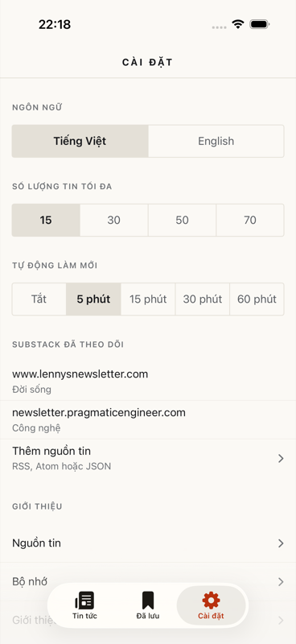
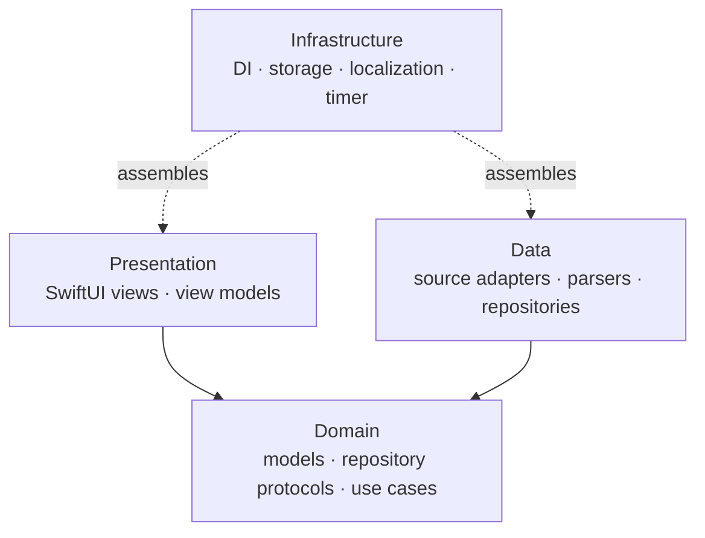

<p align="center">
  
</p>

<h1 align="center">Thông Tấn Xã</h1>

<p align="center">
  A Vietnamese and English news reader for iPhone. Several publications, one feed, no backend of
  its own.
</p>

<p align="center">
  
  
  
  
  <a href="LICENSE"></a>
</p>

VNExpress, The New York Times, BBC News, Eurogamer and any RSS, Atom or JSON feed you add, merged
into one timeline and capped so no single publisher can flood it. Read in Vietnamese or English,
switchable at runtime. Save what you want for later, search what you have already downloaded, and
see exactly which sources are working and which are not.

Everything runs on the device. There is no server between you and the publishers, which is also
why the whole thing keeps working on a train: the disk cache is the source of truth when the
network is not there.

The visual direction is *image-led editorial*. A lead story with a full-bleed photograph, compact
rows beneath it, one accent colour reserved for signal, and a palette whose contrast is recomputed
from the shipped asset catalog on every test run rather than checked once in a spreadsheet.

## Screenshots

Live captures against real feeds, on an iPhone 17 Pro simulator.

<table>
  <tr>
    <th>Feed</th>
    <th>Saved</th>
    <th>Search</th>
  </tr>
  <tr>
    <td></td>
    <td></td>
    <td></td>
  </tr>
</table>

The lead story carries the category. Saving is a long press, confirmed by the row changing rather
than by a message. Search is diacritic insensitive, so typing `the gioi` finds and marks
`thế giới`.

<table>
  <tr>
    <th>Sources</th>
    <th>Settings</th>
  </tr>
  <tr>
    <td></td>
    <td></td>
  </tr>
</table>

Sources is where a broken source stops being a silent hole in the feed: it lists what each one
covers, when it last succeeded, and gives every one of them a switch.

## Features

- **One feed, honestly merged.** Articles from every applicable source, newest first, with no
  single source allowed more than a third of a category while others can fill the gap. An
  aggregator whose feed renders as a single publication is not doing the thing it exists to do.
- **Lead story and compact rows.** The first article gets a full-bleed 16:9 photograph so a three
  second scan has somewhere to land; everything below it is deliberately uniform. An article
  without a usable image falls back to a text-forward composition rather than showing an empty
  band.
- **Vietnamese and English**, switchable in Settings without a relaunch. Some categories only exist
  in the language they make sense for, so the strip changes with it.
- **Sources you can inspect and switch off.** Every built-in source and every feed you added, with
  its current state and when it last worked. Failing sources are lifted to the top, because that is
  why anyone opens the screen. A source you switch off is never attempted, which is also what stops
  it reporting failures.
- **Add any feed, with proof before you commit.** Paste an address and the app fetches it, parses
  it, and shows you the publication's own name and three recent headlines before you add it. A bare
  domain also tries `/feed`, so you do not have to know which one your publication uses.
- **Saved articles**, kept in full rather than as a reference, so the list reads with no connection
  at all. Long press any article to save, share, or open it, and every one of those is available to
  VoiceOver as well as to the gesture.
- **Search what is already on the device.** No requests, works offline, and case and diacritic
  insensitive: `the thao` finds `Thể thao`. Matches are marked in the headline by weight and colour
  rather than colour alone.
- **Read state that survives relaunch**, bounded so it cannot grow without limit, and keyed to the
  article so a refresh that reorders the feed never loses it.
- **You control refreshing.** Off, 5, 15, 30 or 60 minutes. The cache lifetime follows whatever you
  chose rather than a separate fixed number you never saw, and the timer runs in the common run
  loop modes so a scroll cannot suspend it.
- **Honest failure.** Banners name the sources that actually failed, say why in the same vocabulary
  the Sources screen uses, and offer a way through to fix it. A cache hit reports the real age of
  its data rather than the moment it was read.
- **Accessibility taken seriously.** Every string lives in a catalogue. Each article row is a single
  element carrying its headline, source, age and read state, with save, share and open as
  accessibility actions. Dynamic Type is supported to the largest sizes, where the thumbnail steps
  aside and the headline gains lines instead of truncating. Reduce Motion stops the loading pulse
  and the strip's slide; Reduce Transparency turns the edge fade into a hard edge. Every text and
  background pair is verified by computation against WCAG AA, and the measured table is written out
  as a test attachment on every run.

## Tech stack

| Layer | Choice |
| --- | --- |
| Language | Swift 5.9 |
| UI | SwiftUI, hosted in a UIKit `SceneDelegate` |
| Minimum target | iOS 16.0, iPhone only |
| Dependency injection | [Factory](https://github.com/hmlongco/Factory) |
| Feed parsing | [FeedKit](https://github.com/nmdias/FeedKit) (RSS, Atom, JSON) |
| Persistence | `UserDefaults` for preferences and state, a JSON disk cache for articles |
| Project generation | [XcodeGen](https://github.com/yonaskolb/XcodeGen) from `project.yml`; the `.xcodeproj` is gitignored |
| Testing | XCTest, 324 unit tests and 13 UI tests |

## Architecture

Clean-ish layering, with dependencies pointing one way: `Presentation` -> `Domain` <- `Data`.

`Domain` holds the models, the repository protocols and the use cases, and imports no networking,
UIKit or SwiftUI at all. `Infrastructure` wires the cross-cutting concerns and is the only place
that knows how the pieces are assembled.


```mermaid
graph TD
    Pres["Presentation<br/>SwiftUI views · view models"]
    Dom["Domain<br/>models · repository protocols · use cases"]
    Data["Data<br/>source adapters · parsers · repositories"]
    Infra["Infrastructure<br/>DI · storage · localization · timer"]

    Pres --> Dom
    Data --> Dom
    Infra -.assembles.-> Pres
    Infra -.assembles.-> Data
```

| Layer | Contents |
| --- | --- |
| `App/` | `AppDelegate`, `SceneDelegate`, `RootView`, and the debug-only UI test hooks |
| `Domain/` | `Article`, `NewsSource`, `NewsCategory`, `Language`, `NewsError`, `SourceIdentity`, `SourceHealth`, repository protocols, `FetchNewsUseCase`, `RefreshNewsUseCase` |
| `Data/` | `DTOs/`, `Network/` (`NetworkService`, retry and host pacing, `FeedKitRSSParser`), `Sources/` (one adapter per provider), `Repositories/` (`RemoteArticleRepository`, `DiskCacheRepository`) |
| `Infrastructure/` | `DI/Container+Registrations.swift`, `Storage/` (preferences, read state, saved articles, source health, network monitor), `Localization/`, `Timer/` |
| `Presentation/` | `NewsFeed/`, `Saved/`, `Search/`, `Sources/`, `Settings/`, and shared `Components/` including the design tokens |

Adding a source means: create `Data/Sources/<Name>Source.swift` conforming to `NewsSourceAdapter`,
add a DTO under `Data/DTOs/` if the response needs custom decoding, register it in
`Container+Registrations.swift`, and add a case to `NewsSource`.

## Getting started

You need Xcode 15+, [XcodeGen](https://github.com/yonaskolb/XcodeGen), and a free NYT API key.

1. **Install XcodeGen**
   ```bash
   brew install xcodegen
   ```
2. **Clone and set up secrets**
   ```bash
   git clone git@github.com:nphkhiem/vietnews.git
   cd vietnews
   cp Secrets.xcconfig.example Secrets.xcconfig
   ```
3. **Get a key** at [developer.nytimes.com](https://developer.nytimes.com) and enable the Top
   Stories API. Put it in `Secrets.xcconfig`, unquoted, because xcconfig does not strip quotes:
   ```
   NYT_API_KEY = your_real_key_here
   ```
   Every other source needs no key at all. If you skip this step the app still runs; the NYT source
   simply reports itself as failing on the Sources screen.
4. **Generate and open the project**
   ```bash
   xcodegen generate
   open VietNews.xcodeproj
   ```
5. **Build and test from the command line**
   ```bash
   xcodebuild -project VietNews.xcodeproj -scheme VietNews \
     -destination 'platform=iOS Simulator,name=iPhone 17 Pro' build

   xcodebuild -project VietNews.xcodeproj -scheme VietNews \
     -destination 'platform=iOS Simulator,name=iPhone 17 Pro' test
   ```

> [!IMPORTANT]
> **The bundled API key is not secret at runtime.** `Secrets.xcconfig` is gitignored, which
> protects the repository and nothing else: the key is injected into `Info.plist` and ships inside
> the app, so anyone with a copy of a distributed build can read it out of the bundle in seconds.
> Use a free key you are willing to have exposed. A credential that actually mattered would need a
> backend to hold it. The app says as much on its own About screen.

## Tests

`VietNewsTests/` mirrors the production layering (`Domain`, `Data`, `Infrastructure`,
`Presentation`, `Integration`) plus `Fixtures/` and `Helpers/`. `VietNewsUITests/` covers the feed,
saving, the subscription sheet, search and the sources screen, addressing everything by
accessibility identifier so a copy or language change can never break a query.

Two suites are worth knowing about:

- `DesignTokenContrastTests` recomputes WCAG contrast from the shipped asset catalog in both
  appearances, so a nudged colour fails the build rather than shipping.
- `SourceHealthChecks` calls the real endpoints, so it skips itself unless you ask for it. It
  exists to catch a publisher retiring a feed, which is how the Reuters and Reddit sources were
  found dead and removed.
  ```bash
  RUN_SOURCE_HEALTH=1 xcodebuild -project VietNews.xcodeproj -scheme VietNews \
    -destination 'platform=iOS Simulator,name=iPhone 17 Pro' \
    -only-testing:VietNewsTests/SourceHealthChecks test
  ```

## Contributing

1. Fork and branch off `main`
2. Follow the existing layering and naming
3. Run the build and the tests; both should be green with no new warnings
4. Open a pull request describing what changed and why

Bug reports and ideas are welcome as GitHub issues.

## License

MIT, see [LICENSE](LICENSE). Fork it, extend it, ship your own version.
